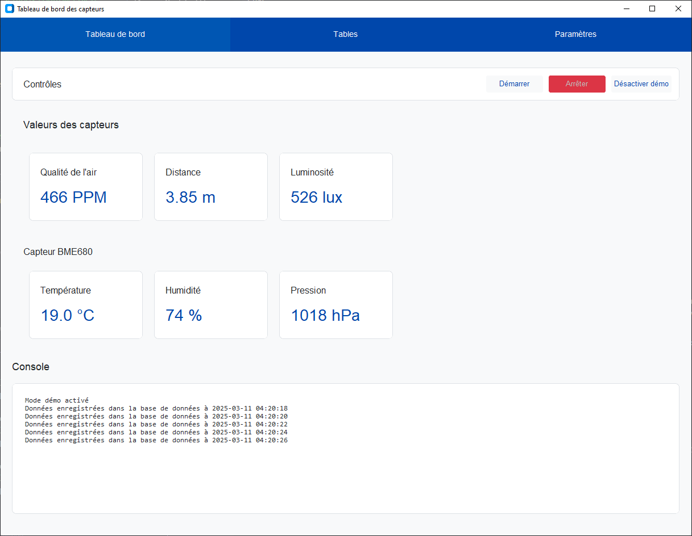

# Projet Tuteuré - Tableau de bord des capteurs

Application de surveillance des capteurs en temps réel avec interface graphique.

## Interface



## Structure du projet

```
projet-tuteure/
├── src/
│   ├── controllers/    # Contrôleurs
│   ├── views/          # Vues
│   │   └── components/ # Composants d'interface
│   ├── models/         # Modèles de données
│   ├── database/       # Gestion de la base de données
│   ├── services/       # Services métier
│   └── utils/          # Utilitaires
├── tests/              # Tests unitaires
├── config/             # Configuration
├── main.py             # Point d'entrée
└── requirements.txt    # Dépendances
```

## Installation

1. Cloner le repository :

```bash
git clone https://github.com/votre-username/projet-tuteure.git
cd projet-tuteure
```

2. Installer les dépendances :

```bash
pip install -r requirements.txt
```

3. Configurer la base de données :

- Créer une base de données MySQL
- Modifier les paramètres de connexion dans `config/settings.py`

## Utilisation

1. Lancer l'application :

```bash
python main.py
```

2. Fonctionnalités :

- Affichage en temps réel des données des capteurs
- Mode démonstration disponible
- Sauvegarde des données dans MySQL
- Interface graphique intuitive

## Capteurs supportés

- MQ135 (Qualité de l'air)
- HC-SR04 (Distance)
- SI1145 (Luminosité)
- BME680 (Température, Pression, Humidité)
